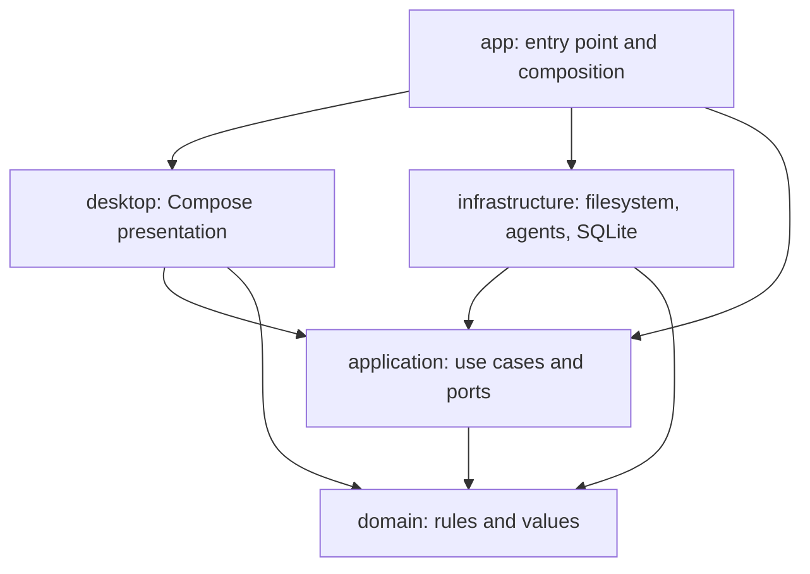

# SkillLink architecture

Status: target architecture for implementation. The repository currently contains documentation; the modules and checks below do not exist yet.

Read [the product idea](idea.md) first. [Code principles](code-principles.md) define Kotlin and build conventions. [Observability policy](observability-policy.md) defines failure reporting. These documents adapt Skill Bill's principles to SkillLink's scope and are self-contained.

## Design principles

### Hexagonal architecture

Domain rules and application use cases form the application core. Desktop interaction drives use cases through typed application APIs. Filesystem, agent integration, and database adapters implement ports owned by the application core. Dependencies point inward.

The composition root creates adapters and supplies them to application services. Application code never locates dependencies through a global registry. Domain and application code never import Compose, Room, JDBC, concrete adapters, or operating-system filesystem APIs.

A port describes a capability a use case needs, with explicit success, failure, cancellation, and ownership semantics. It earns its place through an adapter boundary, another consumer, or a useful test substitute. Do not create a second interface that only repeats a service's public methods.

### Responsibility and simplicity

Keep changes to a responsibility together. Delete forwarding layers and dead helpers before introducing abstractions. Avoid generic workflow engines, speculative plugin frameworks, and wrappers around every identifier.

Use the smallest module structure that enforces the current boundaries. Add a module when dependency ownership requires it. Skill Bill's module count and orchestration systems are not templates for SkillLink.

### State and resource ownership

Each use case owns its coupled transitions. Helpers receive only the values or capabilities they need. Expose immutable results and named operations rather than mutable contexts.

Each acquired resource has one cleanup owner immediately after acquisition. That owner handles success, failure, cancellation, and callback exceptions. Bound cleanup, preserve the primary failure, and record secondary failures. Rethrow coroutine cancellation before broad exception handling.

### Durable state

Declare one authority for each fact. SQLite owns catalog metadata and operation records. Managed files own skill content. Filesystem inspection owns observed link condition. A desired installation in the database does not prove a link exists.

Filesystem operations and database commits are not one transaction. Persist enough operation evidence to distinguish preparation, commitment, cleanup, and rollback. Never report a completed installation from a database row alone.

### Contract enforcement

Validate external input before it becomes domain state. Invalid content, unsupported versions, collisions, permission failures, and unavailable capabilities produce typed outcomes. Preserve missing, failed, and empty as distinct states.

Keep serialized keys, versions, and closed wire tokens under one owner. Schema validation and migrations must preserve user data on failure. Do not recreate a database to hide an incompatibility.

## Target modules and dependency direction

Arrows below show allowed source dependencies. Gradle module names are the intended starting layout.

| Module | Owns | Must not own |
| --- | --- | --- |
| `domain` | Skill identity, name comparison, installation rules, closed outcomes | IO, UI state, persistence entities, agent home discovery |
| `application` | Use cases, port contracts, operation coordination, recovery policy | Concrete filesystem operations, SQL, Compose, dependency wiring |
| `infrastructure` | Filesystem and link operations, agent location resolution, SQLite/Room, diagnostics | UI decisions or independent versions of application policy |
| `desktop` | Compose views, presentation state, user interaction, accessibility | File mutation, SQL, import and rollback rules |
| `app` | Main entry point, composition, application lifetime, packaging | Business logic or a second application service layer |

`app` is the only production composition root and the only module allowed to join concrete infrastructure with presentation. Adapter factories expose only the construction API it needs. Other infrastructure details remain internal.

Keep ports in the owning application area initially. A separate ports or contracts module needs an actual shared boundary. Do not introduce one just to mirror Skill Bill.

## Package ownership

Use `skilllink` as the package root. Cluster by product responsibility within each module, such as `skilllink.application.installation` and `skilllink.infrastructure.installation`.

| Area | Responsibility |
| --- | --- |
| `library` | Managed catalog, content reads and edits, skill identity |
| `installation` | Import, per-agent links, collision handling, operation recovery |
| `agent` | Agent identity, capabilities, global destination resolution |
| `activity` | Recorded events, coverage, activity queries, later collection integrations |
| `trash` | Later removal, retention, and restore behavior |
| `diagnostics` | Structured failure and recovery evidence |

These are ownership boundaries, not a requirement to create empty packages. Keep model types beside their area. Do not collect unrelated types in global `model`, `service`, or `utils` packages.

## Application boundary and ports

The desktop calls named application operations for listing managed skills, reading or saving content, importing a selected skill, enabling or disabling an agent installation, and checking a managed installation's condition.

Use cases expose typed requests and results. Coroutine APIs may express suspension or observation; Compose types and Room entities may not cross this boundary. Ports accept application values and expose operations needed by their consumers. They do not return connections, DAOs, file handles, or an adapter's entire dependency graph.

Initial port responsibilities are:

- Catalog reads and transactional catalog/operation writes.
- Verified copying, content replacement, owned link operations, and rollback cleanup.
- Resolution of a selected agent's global destination and link capability.
- Structured diagnostics.

Name and split interfaces when implementing actual consumers. Keep operations that must share a database transaction behind one transaction-owning capability. Do not pass an arbitrary SQL callback into the application layer.

## Library, identity, and agent adapters

The application-owned root is `~/.skilllink/`, with canonical content in `skills/` and SQLite data in `skilllink.db`. Resolve the current user's home through the platform adapter. Native application binaries remain separate from mutable user data.

The catalog is the entry point for browsing. Scanning agent directories or unrelated folders to build the catalog is forbidden. Explicit import reads only the user-selected source. Checking the intended link destination for a conflict is allowed and must not add that content to the catalog.

Keep stable skill identity separate from display spelling. Name comparison is case-insensitive and locale-independent on every supported operating system. One domain operation computes the comparison key; database uniqueness, import, and restore use that same rule. Pin Unicode normalization and case-folding behavior before implementing the name contract, with examples beyond ASCII. Do not delegate comparison to filesystem behavior or SQLite's default collation.

Validate names as single safe path components. Reject traversal, absolute paths, separators, and names the supported platforms cannot represent. Names do not grant filesystem authority.

Claude, Codex, Junie, and Cursor are the first supported agents. Resolve their global paths and supported overrides inside agent adapters, using Skill Bill's installation behavior as the reference. Reproduce the necessary behavior locally; do not require a Skill Bill installation at runtime.

Platform adapters own symlink creation and capability errors. An unavailable link capability must produce a visible failure. Do not silently substitute copied skills, because subsequent edits would no longer share one source. Test Windows, Linux, and macOS link behavior independently.

Only unlink a path after checking it is the owned link to the expected managed target. Replaced files and foreign links are conflicts. Handle symbolic links inside imported trees explicitly before enabling that import shape; traversal must never escape the selected source or managed destination.

## Installation and interruption protocol

### Commit boundary

An installation attempt has an identity, a reserved name, selected agent destinations, and durable evidence of the files and links it owns. Catalog activation and the committed operation marker share one database transaction.

Before commitment, any interruption requires rollback of that skill's attempt. A retry starts from the beginning after cleanup. After commitment, recovery finishes pending cleanup without undoing the installed skill. This distinction prevents a crash after a database commit from deleting a completed installation.

The application must not report full completion until required cleanup has finished. A committed operation awaiting original-source removal is visible as cleanup pending.

### Required sequence

1. Validate the selected source and name. Reserve the normalized name transactionally. Existing managed names, including case variants, block the operation.
2. Resolve selected global destinations and reject collisions. Persist operation intent before creating artifacts. Use no-replace creation at mutation time as well as preflight checks.
3. Copy into attempt-owned staging and verify the content. Detect source changes during copying. Leave the original untouched on failed verification.
4. Publish the verified managed directory and create owned links. Record sufficient intent before each mutation for crash recovery to identify its artifacts, including crashes between the filesystem action and its completion record.
5. Recheck the source and completed destinations. Commit the catalog, selected installations, and operation marker in one database transaction.
6. Remove the original only while its identity and verified content still match the imported source. If it changed or cannot be removed, preserve it and report cleanup pending. Never recursively delete a replacement path.
7. Remove staging and completed recovery metadata when no longer needed. Report completion and the agent restart reminder.

Source removal and filesystem publication need a platform-specific ownership protocol. Choose and test the concrete locking, identity checking, and recoverable rename steps before enabling destructive import. A hash check followed by an unprotected recursive delete is insufficient.

### Rollback

Rollback removes only the failed attempt's owned links and copied content, clears pending catalog state and the name reservation, and leaves or restores the original source. It must not remove an existing installation or another skill's files.

Cleanup is idempotent. If it fails, retain the operation evidence, show the failure, and block another attempt for that skill. After a crash, run recovery before admitting conflicting mutations. Temporary recovery metadata may remain while cleanup is blocked; it must not appear as an installed skill.

Fresh retries do not reuse partially copied content or count failed attempts as installed skills. Recovery may continue cleanup, but must not continue an uncommitted installation toward success.

### Concurrency

Serialize conflicting mutations in the application and enforce name uniqueness in the database. Multiple app instances must share an ownership mechanism; an in-memory mutex alone is insufficient. Use a process-owned writer lock for the application root initially, with a typed result for another active writer. Recover only after acquiring ownership.

Do not overwrite foreign filesystem changes even while holding the SkillLink lock. That lock coordinates SkillLink instances and cannot lock out external editors or agents.

## Persistence and migrations

Use local SQLite, with the historical desktop Room approach as the implementation reference. Keep Room entities and DAOs inside infrastructure. Schema tables should represent managed skills, intended agent installations, installation operations, and eventually activity evidence and coverage. Add trash storage when implementing trash.

Catalog metadata does not duplicate skill bodies. Canonical files remain the authority for content. Content edits use verified, atomic replacement where the platform supports it and detect conflicting edits. An unsaved editor buffer is presentation state, not durable content.

Run schema readiness and migrations at initialization. Failed migration blocks affected operations and retains the original data. Routine queries do not rerun migrations or repair scans. If readiness is cached, database replacement must invalidate it.

Version persisted contracts and test upgrades with real database fixtures. Transaction ownership belongs to the adapter operation serving the use case; do not spread one logical transaction across independent repository calls.

No cloud storage or analytics backend is required. Activity collection remains separate from local storage and is still research work.

## Desktop state and lifecycle

Compose renders immutable screen state and sends user actions to presentation state holders. State holders call application operations and map typed results to user feedback. They do not manipulate links or database entities.

The application lifetime owns installation and recovery work. Closing a panel or selecting another skill must not cancel an import accidentally. User cancellation before commit requests rollback; after commit it cannot be presented as an undo of the installation.

Keep filesystem and database work off the UI thread. Inject execution contexts at the boundary that owns blocking work. Tie observation to the relevant UI lifetime and close subscriptions when it ends.

Use stable skill identity for list selection. Preserve edit state deliberately when switching skills and provide a clear save or discard flow. Show in-progress, blocked, failed, cleanup-pending, and completed outcomes without making optimistic UI state authoritative.

Expose keyboard navigation, accessible names, focus behavior, and readable error feedback. Use Material 3 components and shared design tokens. After content or installation changes, remind users to restart affected agents; do not claim the agent has loaded the new version.

## Activity and trash boundaries

Activity collectors, once researched, provide evidence through an application ingestion boundary. Validate managed skill identity, agent, event kind, and event time. Keep collection coverage separate from events so an empty query cannot imply tracking was active.

Persist recorded events and coverage in the local database. Handle duplicate source events before deriving counts. A read event remains a read event unless an integration can establish stronger evidence. Recommendations consume recorded activity and coverage, never inferred zeros for untracked agents.

Trash and undo remain optional follow-on work. They require owned-content moves, removal of owned links, and stored restore intent. Restore rechecks name and destination conflicts. Retention and permanent deletion remain product decisions; do not implement an automatic purge policy by assumption.

## Build and distribution

Use Kotlin and Gradle with Compose Multiplatform targeting desktop JVM. Share toolchain and test configuration through convention plugins when modules require it. Choose dependency versions during implementation.

Package DMG for macOS, MSI for Windows, and DEB/RPM for Linux through Compose Desktop native distributions. Build and exercise platform packages on their respective operating systems. Verify that updates preserve `~/.skilllink/` and that uninstall behavior does not silently erase managed skills.

Keep build output, generated database code, installers, staging directories, and local user data out of version control. Publish documented build and test commands when tasks exist.

## Testing and enforcement

Every test should name the realistic regression it catches. Prioritize real filesystem and SQLite boundaries for import, rollback, ownership, and migrations. Inject failures at each installation step and reopen the application state to exercise crash recovery.

Required evidence includes case-insensitive collision rejection, preservation of originals after failed copying, rollback after partial linking, cleanup after committed import, rejection of replaced destinations, and unchanged unrelated skills. UI tests protect interaction and lifecycle behavior rather than screenshots of incidental layout.

No automated architecture guards exist yet. At implementation, maintain one `PrincipleEnforcementInventory` pairing each enforced rule with its proving test. Keep review-only requirements separate. Planned guards should check module dependencies, forbidden framework imports, Kotlin comments, inline qualified names, package/file limits, and governed wire-key ownership.

Source scans must test both allowed and rejected inputs, including newly introduced undeclared keys. They must not claim coverage outside their configured source boundaries. Never grow exemptions or baselines to make new violations pass.

Recovery correctness, cohesion, cancellation, and transaction semantics remain review concerns even when source scans pass.
